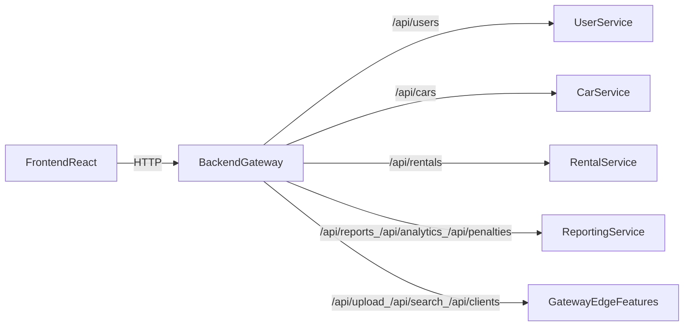

о # Project Specification — Car Rental (Microservices-First)

This document describes **what the project is**, **which features it includes**, and **how the system is intended to look and work** in the current (microservices-first) architecture.

---

## 1) Product overview

**Car Rental** is an information system for a car-rental marketplace / rental point that supports:

- **Car catalog management** (create/update/delete, images, pricing, availability)
- **Rentals / bookings** (book a car for dates, view “my rentals”, staff management)
- **Penalties** (late return / violations) and **reports/analytics**
- **Authentication** and role-based access

The system has been migrated towards **microservices**, with a thin **API Gateway/BFF** in front of services.

---

## 2) Target architecture (how it should look)

### High-level flow



### Services and responsibilities

- **Gateway (`backend/`)**
  - Single entry point for the frontend (`VITE_API_URL=http://localhost:3000/api`)
  - Proxies “domain APIs” to microservices:
    - `/api/cars/*` → `car-service`
    - `/api/users/*` → `user-service`
    - `/api/rentals/*` → `rental-service` (with BFF routes for `/my` and `/book`)
    - `/api/penalties`, `/api/reports`, `/api/analytics` → `reporting-service`
  - Keeps “edge” APIs that can be extracted later:
    - `/api/upload`, `/api/search`, `/api/clients`
    - `/api/auth` (legacy gateway auth; can be replaced by user-service later)

- **User Service (`services/user-service/`)**
  - Source of truth for **accounts** (UUID ids), profile, documents, rating
  - Auth integration (Keycloak + Google flow is present in code)

- **Car Service (`services/car-service/`)**
  - Source of truth for **cars** (UUID ids)
  - Car data model: make/model/year/category/transmission/fuelType/seats + pricing + images

- **Rental Service (`services/rental-service/`)**
  - Source of truth for **rentals** (UUID ids) and penalties table inside rental domain
  - User-specific endpoints:
    - `GET /api/rentals/me`
    - `POST /api/rentals/book`
  - Calls `car-service` to validate car exists / status and to read pricing if needed

- **Reporting Service (`services/reporting-service/`)**
  - Serves `/api/penalties`, `/api/reports`, `/api/analytics`
  - Reads from `rental_service_db` for reports (financial/analytics)

---

## 3) Environments, ports, and required processes

### Default local ports

- **Frontend**: `3001`
- **Gateway**: `3000`
- **User service**: `3002`
- **Car service**: `3003`
- **Rental service**: `3004`
- **Reporting service**: `3009`

### Gateway `.env` (recommended)

```env
PORT=3000
NODE_ENV=development
CORS_ORIGIN=http://localhost:3001

USE_MICROSERVICES=true
USE_RENTAL_MICROSERVICE=true
CAR_SERVICE_URL=http://localhost:3003
USER_SERVICE_URL=http://localhost:3002
RENTAL_SERVICE_URL=http://localhost:3004
REPORTING_SERVICE_URL=http://localhost:3009
SERVICE_API_KEY=internal-service-key

# Legacy gateway auth/DB (still used by /api/auth, /api/clients, /api/search, /api/upload)
DB_HOST=localhost
DB_PORT=5432
DB_USERNAME=postgres
DB_PASSWORD=1234
DB_DATABASE=car_rental_db
JWT_SECRET=your-secret-key-change-in-production
JWT_EXPIRES_IN=24h
```

### Frontend `.env`

```env
VITE_API_URL=http://localhost:3000/api
```

---

## 4) Core user roles and permissions (intended)

There are two “role systems” currently present in code:

1) **Gateway legacy roles** (used by `/api/auth` and some UI gating):
- `admin`, `manager`, `employee`, `user`, plus additional `renter/owner` in newer code paths.

2) **User-service roles** (intended source of truth):
- `renter`, `owner`, `both`, `admin`

**Target state** (microservices-only):

- **renter**: browse cars, book cars, view own rentals, view own penalties
- **owner**: manage own cars (create/update), view rentals for owned cars (future)
- **admin/manager/employee**: staff dashboards, rentals management, reporting

---

## 5) Feature list (what exists / expected behavior)

### A) Cars

**Expected**:
- Browse all cars with filters
- View car details
- Upload images (main + additional)
- Create/update/delete cars (staff/owner)
- Update car status (`active/rented/maintenance/deleted` depending on service)

**Microservice source**: `car-service`

**Gateway route**: `GET/POST/PUT/PATCH/DELETE /api/cars/*` (proxied)

**Frontend compatibility layer**:
- Frontend historically uses `Car` with fields `brand/type/pricePerDay/deposit/status`
- `frontend/src/services/carService.ts` maps microservice DTO (`make/category/pricing/images`) into the legacy UI shape.

### B) Rentals / Bookings

**Expected**:
- “Booked dates” calendar for a car
- Book a car for selected dates
- View “My rentals” for current renter

**Microservice source**: `rental-service`

**Gateway BFF**:
- `GET /api/rentals/my` → calls `rental-service /api/rentals/me` and maps response
- `POST /api/rentals/book` → calls `rental-service /api/rentals/book`

**Important constraint**:
- `carId` must be a **UUID string** when booking in microservices mode.

### C) Penalties, Reports, Analytics

**Expected**:
- List penalties
- Financial/occupancy/availability reports
- Basic analytics dashboards

**Microservice source**: `reporting-service`

**Gateway route**:
- `/api/penalties`, `/api/reports`, `/api/analytics` are proxied to reporting-service.

### D) Auth

**Current reality**:
- Frontend uses `frontend/src/services/authService.ts` → `/api/auth/login`, `/api/auth/register`, `/api/auth/me`
- That is **gateway legacy auth**, backed by `car_rental_db` tables in `backend/src/models/*.entity.ts`.

**Target**:
- Move auth to **user-service** (Keycloak/Google), and have the gateway only validate tokens and proxy.

### E) Upload, Search, Clients

These currently live in gateway (still tied to `car_rental_db` in parts). Target is to keep them as “edge features” or extract later.

---

## 6) API shapes (summary)

### Car service DTO (source of truth)

- Car `id`: UUID string
- Key fields: `make`, `model`, `year`, `category`, `transmission`, `fuelType`, `seats`, `status`
- Pricing: `pricing.dailyRate`, `pricing.depositAmount`
- Images: `images[]` with `imageUrl`, `isPrimary`

### Frontend Car entity (legacy UI shape)

`frontend/src/interfaces/entities.ts` expects:
- `brand`, `type`, `pricePerDay`, `deposit`
- The mapper in `frontend/src/services/carService.ts` converts from service DTO into this shape.

### Rental service DTO (source of truth)

- Rental `id`: UUID string
- `carId`: UUID string
- `renterUserId`: UUID string
- date fields + amounts + status

Gateway maps to frontend-compatible DTO for `/api/rentals/my`.

---

## 7) How to run (developer workflow)

### Option A: run processes locally (npm)

Run each in its directory:

- `services/user-service`: `npm run dev`
- `services/car-service`: `npm run dev`
- `services/rental-service`: `npm run dev:clean`
- `services/reporting-service`: `npm run dev`
- `backend`: `npm run dev`
- `frontend`: `npm run dev`

### Option B: infra via docker-compose

`docker-compose.yml` provides Postgres, Kafka, Redis, Elasticsearch, Keycloak, etc. Use it for infra, while app services can run locally.

---

## 8) Known gaps / technical debt (what to fix next)

- **Dual auth sources** (gateway JWT vs user-service Keycloak/Google) need consolidation.
- **Car create/edit form** in frontend still uses legacy field names; mapping is currently done in service layer to keep UI working.
- **Gateway DB coupling** still exists for `/api/auth` and other edge features.
- Add a single command to run all services (root `package.json` + `concurrently`) if desired.

---

## 9) “Clean microservices-only” target checklist

To consider the monolith fully removed:

- [ ] Frontend no longer depends on `/api/auth` legacy and uses user-service auth
- [ ] Gateway no longer uses `backend/src/models/*.entity.ts` at all
- [ ] `car_rental_db` is not required for local run
- [ ] All domain data is in microservice DBs only

